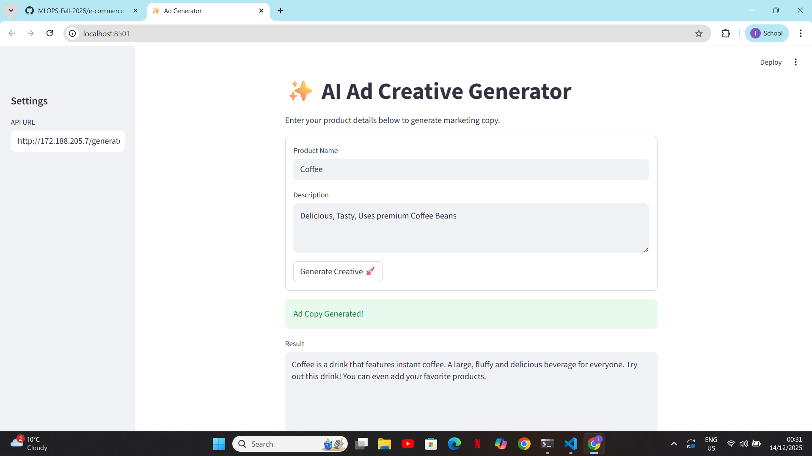
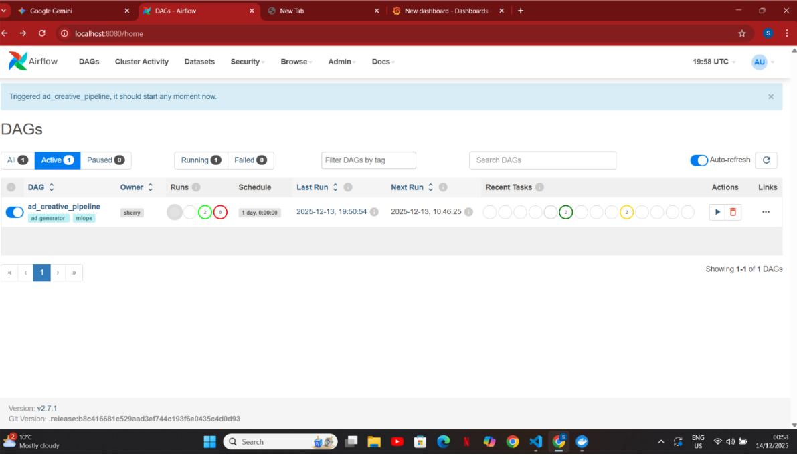
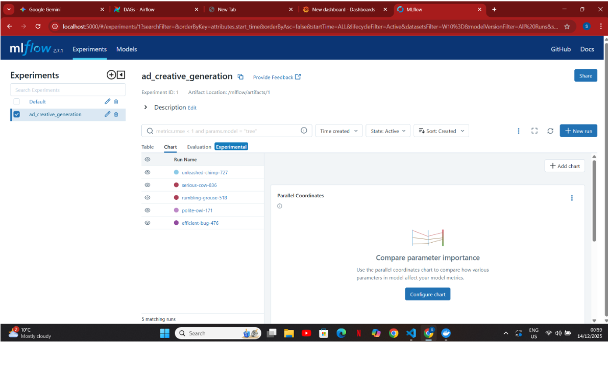
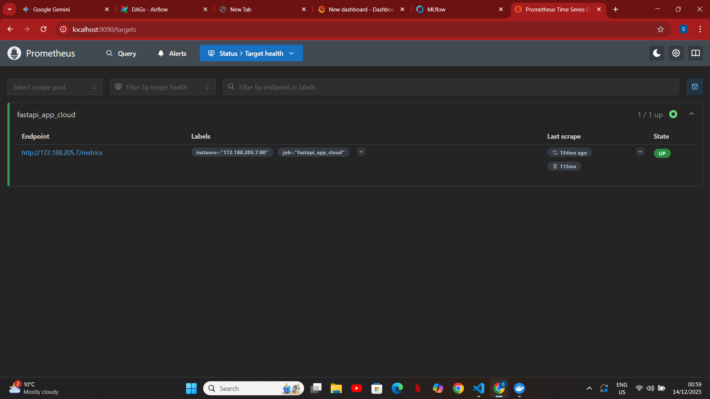
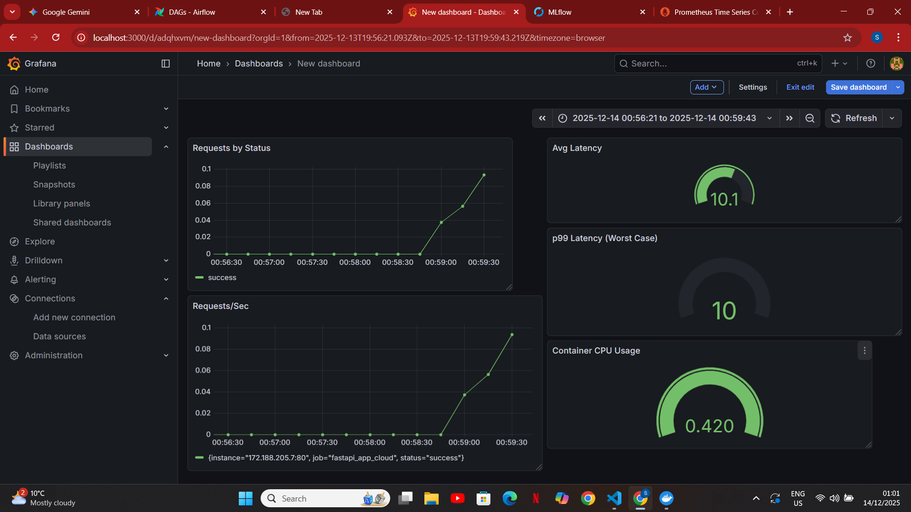

# 🚀 Intelligent E-Commerce Ad Creative Generator

## Project Overview

The **Intelligent E-Commerce Ad Creative Generator** is a cutting-edge MLOps platform that leverages a fine-tuned LLM (Google FLAN-T5) to automatically generate catchy, high-converting social media ad copy from product descriptions. The system is fully containerized, orchestrated on Azure Kubernetes Service (AKS), and features a robust CI/CD pipeline, real-time monitoring, and a user-friendly Streamlit frontend for seamless user interaction.

---

## 🏗️ System Architecture Diagram

**Flow:**

```
User → Streamlit App → AKS LoadBalancer (172.188.205.7) → FastAPI Pod → FLAN-T5 Model
```

- **User** interacts with the Streamlit frontend.
- **Streamlit** sends requests to the AKS LoadBalancer.
- **LoadBalancer** routes traffic to the FastAPI backend pod.
- **FastAPI** serves the fine-tuned FLAN-T5 model for ad generation.

---

## 🌟 Project Screenshots

### 1. Streamlit Frontend (Ad Generation UI)


### 2. Airflow DAGs (Automated Pipeline)


### 3. MLflow Experiment Tracking


### 4. Prometheus Target Health


### 5. Grafana Dashboard (Monitoring)


---

## 🔑 Key MLOps Features

- **Automated Data & Training Pipeline:**
  - Apache Airflow DAGs automate data ingestion and model training simulation.
- **Experiment Tracking:**
  - MLflow tracks model versions, parameters, and metrics.
- **Containerization:**
  - All services are Dockerized for reproducibility and portability.
- **Orchestration:**
  - Deployed on Azure Kubernetes Service (AKS) with scalable pods and LoadBalancer.
- **CI/CD:**
  - GitHub Actions workflow automates Docker image builds and pushes on code changes.
- **Monitoring & Observability:**
  - Prometheus scrapes system and application metrics.
  - Grafana dashboard visualizes throughput (Req/sec) and latency.
- **Frontend:**
  - Streamlit app provides an intuitive UI for users to generate ads.

---

## 🛠️ Setup & Installation (Local)

1. **Clone the repository:**
   ```bash
   git clone git@github.com:MLOPS-Fall-2025/e-commerce-ad-creative-generator-Shaharyar2442.git
   cd e-commerce-ad-creative-generator
   ```
2. **Start all services locally:**
   ```bash
   docker compose up -d --build
   ```
   _This command launches Airflow, Postgres, MLflow, Prometheus, and Grafana locally._
3. **Install Python dependencies:**
   ```bash
   pip install -r requirements.txt
   ```
4. **Run the Streamlit frontend:**
   ```bash
   streamlit run src/app/frontend.py
   ```

---

## ☁️ Cloud Deployment Commands (Azure)

1. **Create AKS Cluster:**
   ```bash
   az aks create ... # (fill in your Azure parameters)
   ```
2. **Deploy Kubernetes manifests:**
   ```bash
   kubectl apply -f k8s/manifests/
   ```
3. **Restart deployment (if needed):**
   ```bash
   kubectl rollout restart deployment
   ```

---


## 📦 Model & API Details

- **Model:** `google/flan-t5-small` (fine-tuned, inference-optimized)
  - Hugging Face Transformers
  - Creative sampling (temperature=0.9) for engaging ad copy
- **API:** FastAPI backend (`src/app/main.py`)
  - `/generate` endpoint for ad creation
  - `/metrics` endpoint for Prometheus scraping
- **Docker Image:**
  - Hosted on Docker Hub: `shaharyarrizwan/ad-generator-api`

---

## 📈 Monitoring & Observability

- **Prometheus:** Scrapes FastAPI and system metrics
- **Grafana:**
  - Dashboard visualizes:
    - **Throughput (Req/sec)**
    - **Latency**

---

## 🤝 Contributing

Contributions are welcome! Please open issues or submit pull requests for improvements.

---

## 📄 License

This project is licensed under the MIT License.
